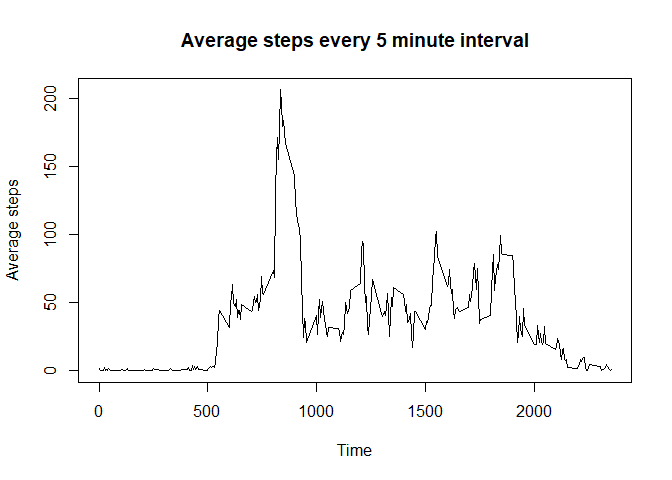
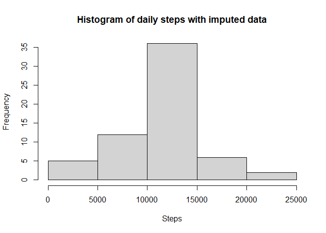

## Loading and preprocessing the data

```r
data <- read.csv("activity.csv")
```


## What is mean total number of steps taken per day?

```r
library(reshape2)
s_day <- dcast(data,date~.,value.var="steps",sum)
colnames(s_day) <- c("date","steps")
hist(s_day$steps,xlab="Steps",main="Histogram of daily steps")
```

<!-- -->

```r
mn <- as.integer(mean(s_day$steps,na.rm=TRUE))
mdn <- median(s_day$steps,na.rm=TRUE)
```
Mean number of steps taken per day is 10766.
Median number of steps taken per day is 10765.

## What is the average daily activity pattern?

```r
s_min <- dcast(data,interval~.,value.var="steps",mean,na.rm=TRUE)
colnames(s_min) <- c("interval","steps")
plot(s_min$interval,s_min$steps,type="l",xlab="Time",ylab="Average steps")
title(main="Average steps every 5 minute interval")
```

<!-- -->

```r
max <- round(max(s_min$steps),2)
int <- s_min[s_min$steps==max,]$interval
```
The interval with the maximum number of steps is  with 206.17 steps.

## Imputing missing values

```r
miss <- sum(is.na(data))
```
The number of missing values is 2304.

```r
n_data <- data
for(i in 1:nrow(n_data)){
  if(is.na(n_data[i,"steps"])){
    r <- match(n_data[i,"interval"],s_min$interval)
    n_data[i,"steps"] <- s_min[r,"steps"]
  }
}  
ns_day <- dcast(n_data,date~.,value.var="steps",sum)
colnames(ns_day) <- c("date","steps")
hist(ns_day$steps,xlab="Steps",main="Histogram of daily steps with imputed data")
```

<!-- -->

```r
n_mn <- as.integer(mean(ns_day$steps))
n_mdn <- as.integer(median(ns_day$steps))
```
New mean number of steps taken per day is 10766.
New median number of steps taken per day is 10766.

The mean is still the same but the mean and median are equal now.The frequency of total daily steps between 10000 - 15000 has increased. 

## Are there differences in activity patterns between weekdays and weekends?

```r
library(dplyr, warn.conflicts=F)
library(lubridate, warn.conflicts=F)
```

```r
library(ggplot2)
n_data <- mutate(n_data, day=wday(date,week_start=1))
day2 <- NULL
for(i in 1:length(n_data$day)){
    if(n_data$day[i]<6){
            day2 <- c(day2,"weekday")
    } else if(n_data$day[i]>=6){
            day2 <- c(day2,"weekend")
    }
}
n_data <- cbind(n_data,factor(day2))
ns_min <- dcast(n_data,interval+day2~.,value.var="steps",mean,na.rm=TRUE)
colnames(ns_min) <- c("interval","day2","steps")
g <- ggplot(ns_min,aes(interval,steps))
g + geom_line() + facet_grid(vars(day2))
```

<!-- -->
